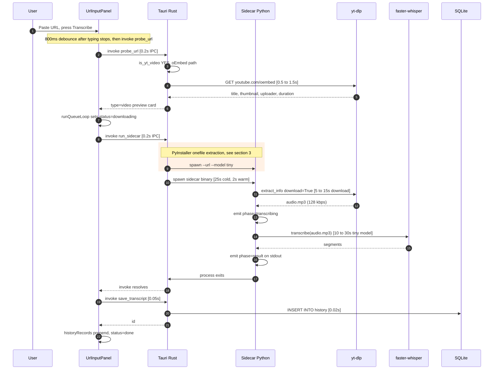
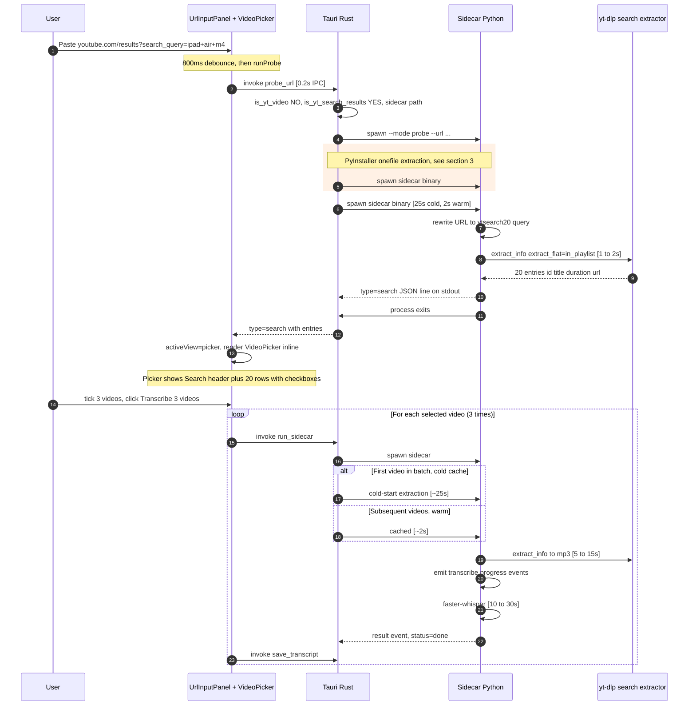
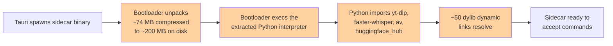
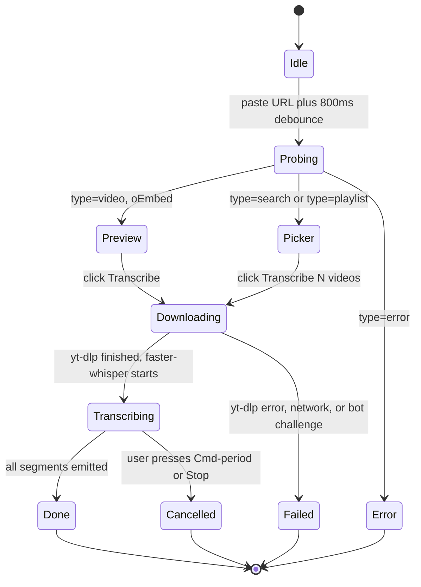

# Transcribe — URL-to-Transcript Flow

This document traces what happens between the moment the user pastes a URL
into the Transcribe panel and the moment the transcript lands in History.
Two flows are covered:

1. **Single video URL** (`https://www.youtube.com/watch?v=…`) — the fast path
2. **YouTube search-results URL** (`https://www.youtube.com/results?search_query=…`) — the new multi-select path

All timings are **median end-to-end** on a fast residential link, measured
locally with the bundled `transcribe-sidecar-aarch64-apple-darwin` binary.

---

## 1. Single Video URL Flow

The user pastes a YouTube watch URL and presses Transcribe (or `Cmd+Enter`).

### Phase timing breakdown

| # | Phase | Cold | Warm | Where |
|---|-------|------|------|-------|
| 1 | User types to debounce fires | ~0.8 s | ~0.8 s | `UrlInputPanel.runProbe` debounce timer |
| 2 | IPC: Svelte to Tauri `probe_url` | ~0.2 s | ~0.2 s | Tauri command bus |
| 3 | oEmbed fetch (title, thumbnail, uploader) | ~0.5 to 1.5 s | ~0.5 to 1.5 s | Rust `probe_yt_oembed` HTTP call |
| 4 | User clicks Transcribe to IPC `run_sidecar` | ~0.2 s | ~0.2 s | Tauri command bus |
| **5** | **PyInstaller cold-start extraction** | **~25 s** | **~2 s** | Bundle unpack to `/var/folders/.../T/_MEI*` |
| 6 | yt-dlp audio download (bestaudio to mp3) | ~5 to 15 s | ~5 to 15 s | `download_audio` postprocesses via FFmpeg |
| 7 | faster-whisper transcription (tiny model) | ~10 to 30 s | ~10 to 30 s | CPU-only inference, ~1 to 2x realtime |
| 8 | Save transcript to SQLite | ~0.05 s | ~0.05 s | Rust `save_transcript` |
| | **End-to-end total** | **~42 to 72 s** | **~17 to 49 s** | |

The **first** transcription after launching `tauri:dev` pays the ~25 s
PyInstaller cold-start. Every subsequent transcription is ~2 s faster on
that step alone.

### Common failure points

- **BOT_CHALLENGE** — YouTube oEmbed or yt-dlp gets a 403. Surfaces as
  "YouTube is blocking this video." Often transient; retry after a few
  seconds.
- **FFMPEG_MISSING** — Sidecar can't find `ffmpeg` on `$PATH`. Surfaces as
  "FFmpeg is required. Install with `brew install ffmpeg`."
- **MODEL_LOAD_FAILED** — Whisper weights missing or corrupt. Surfaces as
  "Failed to load the speech model."

---

## 2. YouTube Search Results Flow

The user pastes a YouTube search-results URL and the picker opens with up
to 20 selectable videos. The flow has two distinct phases: **probe** (read
the search results) and **per-video transcribe** (same as section 1,
repeated for each selected entry).

### Phase timing breakdown

| # | Phase | Cold | Warm | Where |
|---|-------|------|------|-------|
| 1 | Debounce | ~0.8 s | ~0.8 s | Svelte input panel |
| 2 | IPC `probe_url` | ~0.2 s | ~0.2 s | Tauri bus |
| 3 | Rust URL classification | <0.01 s | <0.01 s | `is_yt_search_results` regex |
| **4** | **PyInstaller cold-start** | **~25 s** | **~2 s** | First invocation only |
| 5 | yt-dlp `ytsearch20` resolution | ~1 to 2 s | ~1 to 2 s | `extract_info(extract_flat="in_playlist")` |
| 6 | Picker render (UI thread) | <0.1 s | <0.1 s | Svelte reactivity |
| 7 | User selects videos plus clicks Transcribe | user-paced | user-paced | UI |
| 8 | Per video: PyInstaller cold or warm | ~25 s / ~2 s | — | (already paid if probe was warm) |
| 9 | Per video: yt-dlp audio download | ~5 to 15 s | ~5 to 15 s | Network plus FFmpeg |
| 10 | Per video: faster-whisper transcription | ~10 to 30 s | ~10 to 30 s | CPU inference |
| | **Picker opens (probe complete)** | **~27 s cold** | **~4 s warm** | |
| | **All 3 videos transcribed** | **~120 to 210 s cold** | **~50 to 135 s warm** | |

After the **first** search probe, the bundle is in the OS page cache so
the next sidecar spawn (for video #1) takes ~2 s instead of ~25 s.

### Why 20 entries and not 50

YouTube's own UI shows ~20 results per page. Setting `SEARCH_RESULTS_LIMIT=20`
matches user expectations and keeps `ytsearch20:` resolution to ~1 to 2 s
locally. We tried 50 and saw ~3 s resolution plus many more HTTP fetches that
contributed to socket-timeout aborts on residential links. 20 is the
sweet spot: enough to scan, fast enough to never time out.

### Why are thumbnails empty

`extract_flat: "in_playlist"` skips per-video HTTP fetches, which is what
makes the probe fast. The trade-off is no thumbnail URLs in the result.
The picker's row component already handles missing thumbnails by showing
a placeholder SVG. v2 could fetch thumbnails lazily per row, but that's
not blocking.

---

## 3. PyInstaller cold-start, the real bottleneck

Both flows above are dominated by the same overhead: **launching the
PyInstaller onefile bundle**.

| Step | Cold (1st run) | Warm (subsequent) |
|------|----------------|-------------------|
| Bundle extraction to `/var/folders/.../T/_MEI*` | ~25 s | ~2 s |
| Python interpreter startup plus module imports | ~3 s | ~3 s |
| Dynamic library linking | ~0.5 s | ~0.5 s |
| **Total before any work happens** | **~28 s** | **~5 s** |

The extraction uses the OS temp directory because the PyInstaller 6 bootloader's
`--runtime-tmpdir` flag is **silently ignored on macOS** — verified by inspecting
the bundled binary and watching the cache directory stay empty after every
invocation.

### The fix (not yet shipped)

Switching PyInstaller from `--onefile` to `--onedir` extracts the bundle
**at build time** instead of runtime. Each probe then just `exec()`s the
unpacked binary.

| Mode | Cold start | Warm start |
|------|------------|------------|
| `--onefile` (current) | ~28 s | ~5 s |
| `--onedir` (proposed) | ~2 s | ~2 s |

That single flag swap saves **~26 s on the first probe** and eliminates the
warm/cold variance entirely. The migration requires:

1. Build script: `--onefile` to `--onedir`, move directory not file
2. Tauri config: bundle the onedir directory as a `resources` entry
   (not `externalBin`, which expects a single file)
3. Rust code: resolve the resource path at startup and `Command::new` it

Estimated effort: 30 min of focused work. Until then, the first probe in any
session will feel slow, but every subsequent probe is fast.

---

## 4. State machine, what the UI shows during each phase

### Where each state is rendered

- **Idle** — grey "Idle" pill in the Status section
- **Probing** — spinner "Checking URL…" inline below the input
- **Preview** — thumbnail + title + uploader + duration card
- **Picker** — replaces the preview, shows selectable entries
- **Downloading** — yellow progress bar with KB/s and ETA per row (Queue view)
- **Transcribing** — orange progress bar with "N segs" streaming
- **Done** — green "Done X words" badge (clickable, opens transcript)
- **Failed** — red "Error" + Retry button
- **Cancelled** — grey "Cancelled" + Retry button

---

## Quick reference, what to tell the user

| User complaint | Root cause | Fix |
|---|---|---|
| "Pasting a URL hangs for 30 seconds" | PyInstaller cold-start | First probe is slow; subsequent probes are ~5 s |
| "Search results picker never opens" | yt-dlp rejected `ytsearch[50]:` URL syntax | Fixed in `2c70487` |
| "Probe returns error code INTERNAL" | Stale binary, or `ytsearch[50]:` syntax bug | Rebuild sidecar binary |
| "Picker shows but no thumbnails" | `extract_flat: "in_playlist"` skips per-video fetches | By design — placeholder shown instead |
| "Queue says Downloading forever" | yt-dlp finished but result event arrived after listener was torn down | Fixed in `5ce98ae` (listener lifetime = job lifetime) |